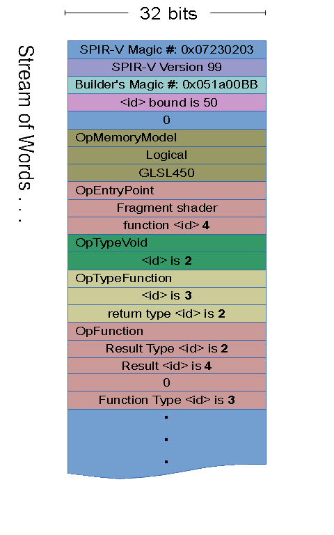
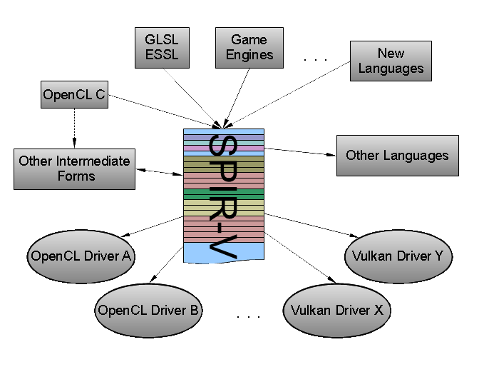
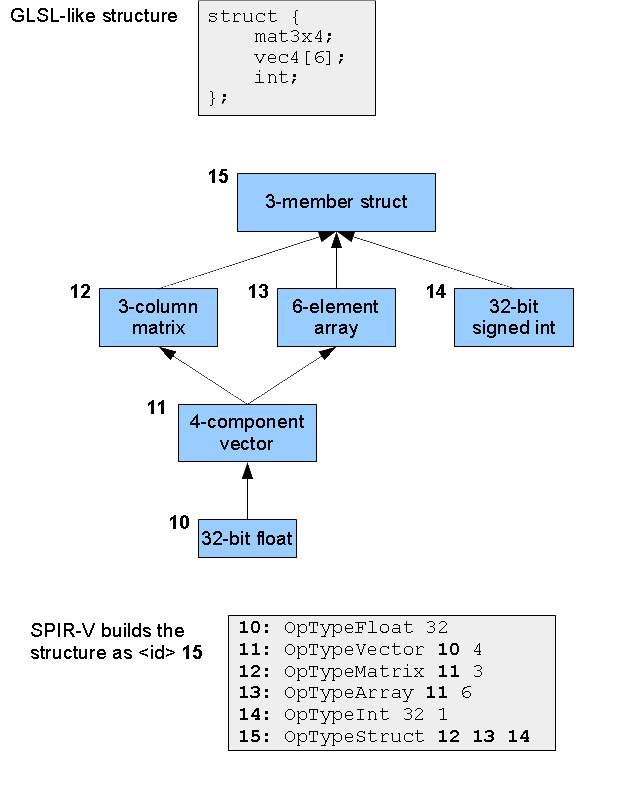
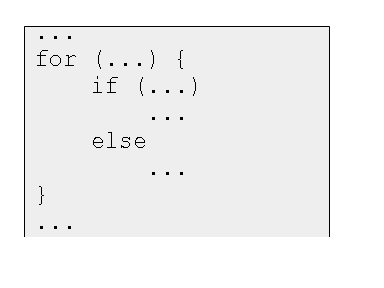
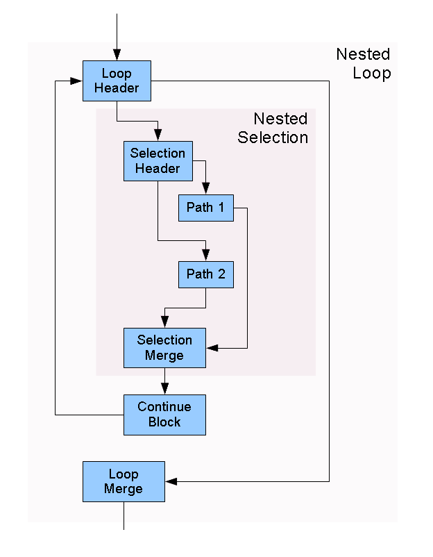

// Copyright 2015-2026 LunarG, Inc.
// SPDX-License-Identifier: CC-BY-4.0

SPIR-V
======
:Author: John Kessenich, LunarG

ifdef::backend-html5[]

*A Khronos-Defined Intermediate Language for Native Representation of Graphical Shaders and Compute Kernels*

Copyright 2015-2026, LunarG, Inc. +
SPDX-License-Identifier: CC-BY-4.0

endif::[]

:numbered:

Introduction
------------

[[BinaryLanguage]]
.The SPIR-V Binary Intermediate Language. The first 5 slots form the header. The remaining slots hold a linear sequence of variable-length instructions (one per color in the figure). Each instruction starts with a word that encodes the instruction's opcode and size, followed by a variable number of 32-bit operands.

[abstract]
--
Abstract. *SPIR-V* is a new platform-independent intermediate language.
It is a self-contained, fully specified, binary format for representing graphical-shader stages and compute kernels for multiple APIs.
Physically, it is a stream of 32-bit words.  Logically, it is a header and a linear stream of instructions.  These encode, first, a set of annotations
and decorations, and second a collection of functions.
Each function encodes a control-flow graph (CFG) of basic blocks, with additional instructions to preserve source-code structured flow control.
Load/store instructions are used to access declared variables, which includes all input/output (IO).
Intermediate results bypassing load/store use static single-assignment (SSA) representation.
Data objects are represented logically, with hierarchical type information:  There is no flattening of aggregates or assignment to physical register banks, etc.
Selectable addressing models establish whether general pointers may be used, or if memory access is purely logical.
--

NOTE: A provisional SPIR-V specification was released March 3rd, 2015 by Khronos.
It contains the full instruction set and specification, and can be used as a reference while reading this paper.

What SPIR-V Accomplishes
~~~~~~~~~~~~~~~~~~~~~~~~

[[SPIRDiag]]
.SPIR-V serves as a common single language for multiple languages feeding multiple drivers.  It can also target other languages. It is fully defined by Khronos, and can natively represent the features needed by graphical shaders and compute kernels.

SPIR-V is a relatively high-level intermediate language.  It is:

- low-level enough to bypass all text-based parsing, dependence on a single high-level language, and avoid portability issues caused by the convenience of high-level languages, and
- high-level enough to be device independent and to not lose information needed for maximum performance on the target device.

How does SPIR-V meet common expectations of an intermediate language (IL)?

[float]
Portability
^^^^^^^^^^^

SPIR-V improves portability in three ways:

. Enabling shared tools.
There is no need for every hardware platform to provide its own high-level language translator.
Such translators can be much fewer in number than the compiler back ends SPIR-V will feed.

. A single tool set for a single ISV.
An individual ISV can generate SPIR-V with a single tool set, eliminating all issues with portability of the high-level language.

. SPIR-V is simpler.  It is easier to have a fully concise, pinned down, description of SPIR-V than of a high-level language.
Getting independent implementations to match SPIR-V processing is correspondingly simpler.
Some examples of this, comparing to GLSL:

- Policies for qualifier defaults, inheritance, etc., are gone. Everything is explicit (precision, row_major, stream number, etc.).
- No implicit conversions.
- No function overloading or resolution; call sites identify the specific function instance to call.
- Only one compilation unit; multiple compilation units that need to merge to form a single executable will be merged by a front end.
- The variable name space is flat; there are no nested scopes.

[float]
Performance
^^^^^^^^^^^

Expectations around compile-time performance with an IL vary wildly, and indeed, SPIR-V experience will
depend highly on how applications generate shaders, the way shaders are cached, the performance of the underlying target compiler,
and what optimizations were done offline.  Online performance results include some combination of:

- eliminating the compiler front end; this processing, including reflection, can be done offline
- optimization passes that settle faster, for optimizations done offline
- time saved when multiple source shaders reduce to the same IL instruction stream
(this multiplies any expectations of the first reason by a factor equal to the many-to-one mapping present between source shaders and unique ILs)

Your mileage will definitely vary. How much SPIR-V should be optimized before entering the run-time driver is discussed further down.
Note that a typical optimizing run-time compiler will execute register allocation and scheduling transformations specific to the target system.
These transforms tend to be computationally expensive and can only be done in a platform-specific compiler layer (back end).

[float]
Multiple Source Languages
^^^^^^^^^^^^^^^^^^^^^^^^^

SPIR-V is fully set up to support multiple source languages.  It includes all the features needed
to support shipping GLSL shaders, OpenCL C kernels, and support for C++ is progressing.

SPIR-V also enables development of new experimental languages.

[float]
IP Protection
^^^^^^^^^^^^^

SPIR-V is sufficiently far removed from source code that a significant explicit step is required to recover the original.
Without tools, its raw binary form is difficult to read or modify.

[float]
Additionally...
^^^^^^^^^^^^^^^

In addition to the primary expectations above, SPIR-V meets the following goals:

*Self Contained:*  Khronos fully defines SPIR-V in Khronos specifications.

*Native Representation:* SPIR-V contains, natively, the constructs needed to represent the functionality in Khronos source languages, including
objects like matrices and images.

*Simple:*  Tool sets need to find SPIR-V binary form simple to read and process.  This is achieved through a highly-regular linear stream of words.
Instructions encode their size, making it easy to process just the instructions of interest while skipping irrelevant (or unrecogized) instructions.
New instructions can be added through extensions without breaking existing tools.

*Binary Representation:* SPIR-V is the binary form that an API entry point will accept, to eliminate all need for parsing and string processing in the driver.

*Easy to Convert to other IRs:* SPIR-V is a relatively high-level IL, preserving all vital information from the source language needed to
translate it easily to existing intermediate representations drivers are likely to have in their stacks.
It is higher-level than some existing graphical ILs, preserving more information that allows translation to higher-performance run-time code.

*Extendable:* The ability for single vendors or groups of vendors to extend an API/IL is important to Khronos.
SPIR-V is easily extended:

- Tools are written to only process instructions they understand, skipping others, making it easy to extend SPIR-V without breaking tools.
- The *OpExtension* instruction declares extensions that semantically require processing new instructions.
- Sets of extended instructions can be provided and specified in separate specifications.
This is done for core versions of graphics and OpenCL modules, for operations like sin, cos, min, max, exp, etc.
- Reserving (registering) vendor-specific ranges of enumerants.

Optimization
~~~~~~~~~~~~

SPIR-V can be partially optimized off line, to reduce amount of optimization needed on line.  However, this should be done with care,
as too much optimization can lose information a target device needs to attain its highest performance.
Typically, the following are relatively safe optimizations to perform:

- simple constant propagation
- constant folding and coalescing
- dead code, type, variable, and function elimination
- moving from a load/store form of shader variables to an SSA intermediate-object form, and using phi-functions for impacted flow-control
- simple if-conversion to select for single operations

These optimizations, however, potentially hurt performance, and are generally undesirable:

- function specialization
- inlining functions that have multiple call sites
- general loop unwinding or unrolling (except perhaps small loops with statically known small number of iterations)
- common subexpression elimination that increases data pressure
- code motion that increases data pressure
- complex transforms that lose information valuable to back-end optimizations

So, the above list should be avoided in off-line transforms of SPIR-V meant to be portable across devices.

Instead of doing such undesirable optimizations off line, SPIR-V has optimization control enumerants for loops, functions, and branches that
allow communicating, say, that a loop is faster if not unrolled, based on some knowledge not present in the module itself.  Such
controls should be respected by target devices.  See, for example, *DontUnroll* or *Inline* in the specification.

The SPIR-V Language
-------------------

Here is a simple OpenCL example, which will make more sense as this section unfolds:

OpenCL C Kernel:

----------
include::add.cl[]
----------

<<<<<<<<<<<<<<<<
Corresponding (human readable) SPIR-V:

----------
include::add.dis[]
----------

For an example of a graphics shader, see the example in the SPIR-V specification.

Result <id>s, Variables, and SSA Form
~~~~~~~~~~~~~~~~~~~~~~~~~~~~~~~~~~~~~

SPIR-V is based on each type declaration, each variable, each operation result, etc., getting a unique name: a 'result <id>'.
No result <id> can be re-targeted by another different instruction, and all consumed <id>s are defined somewhere as a result <id>.
Thus, any consumed <id> will have exactly one place it is defined.

When looking at examples, most opcodes result in an result <id>, and this is the first number shown, before the ``:''.
In the following:

-----
16:  TypeInt 32 0  // 16 is the unique result <id> of this instruction
-----

Text outside of a listing, including the specification, refer to this opcode as *OpTypeInt*, but it is shortened to just ``TypeInt'' in the disassembly, where it is clear it's the opcode.

[float]
Variables and Intermediate Objects
^^^^^^^^^^^^^^^^^^^^^^^^^^^^^^^^^^

Some instructions produce an object as an intermediate result, meaning it is not allocated in memory, while other instructions can allocate a variable in memory.
For example:

-----
17:    TypePointer PrivateGlobal 16  // type 17 is a pointer type to a global of type 16
18: 17 Variable PrivateGlobal        // make a variable of type 16; 18 is a pointer to it
19: 16 Load 18                       // 19 is an intermediate object of type 16
20: 16 IAdd 19 19                    // 20 is an intermediate object of type 16
       Store 18 20                   // store result of add back into the variable
-----

Above, *PrivateGlobal* is a 'storage class', of which there are many, including the *Function* storage class for function local variables.
Some storage classes are for IO and, fundamentally, IO will be done through load/store.

Also, note the store instruction does not have a result <id> that participates in the SSA name space.

The above example also introduce 'result types' which are the second number on some lines.  These are the type of the result of the instruction, and
refer to the <id> of the appropriate type declaration.

[float]
Static Single Assignment (SSA)
^^^^^^^^^^^^^^^^^^^^^^^^^^^^^^

An important, intentional, side effect of each <id> defined by exactly one instruction, is that SPIR-V is always in static single assignment (SSA) form.
The SSA from of SPIR-V is defined in terms of the result <id>, and not memory loads and stores.
This standard form is in common use now, and there is quite a bit of information available for it.

[float]
Phi-Function
^^^^^^^^^^^^

A common optimization would be to eliminate unnecessary loads and stores, making more use of intermediate objects instead.
For IO storage classes, the initial load and final store can never be eliminated.  However, for many variables, the memory
could be completely eliminated by removing all loads and stores for them.

SPIR-V includes an *OpPhi* opcode to allow the merging together of intermediate results from split flow control.
This allows computation across control flow, without needing store to memory, while still maintaining SSA form.
*OpPhi* lists each parent block in the CFG, and for each parent block, which variable to merge into the new name.
(The new name is the result <id> of the *OpPhi* instruction.)

Decorations
~~~~~~~~~~~

Generally, source-level languages for shaders and kernels have a number of unusual qualifiers and variables.
Most of these are handled as 'decorations' in SPIR-V, for two reasons:

- any particular one of these would apply to only a small subset of declarations
- they normally have no effect on the semantics of operation with the instruction stream in SPIR-V

That is, they are both sparse and typically ``pass-through'' semantics, versus information that internally effects the semantics of the SPIR-V instruction stream.
Hence, these are not an intrinsic part of declaring a variable, type, etc., but instead a 'decoration' that is declared independently.  For (a graphics) example:

-------
       Decorate 39 NoPerspective  // will make 39 use "noperspective" interpolation
       ...
39: 22 Variable Input             // define 39 (through type 22) as an input variable
-------

Decorations are declared early, as a forward reference, so that when the object or type is actually made, everything is known about it.

SPIR-V also identifies built-in variables from a high-level language with *OpDecoration*, where the decoration is *BuiltIn*, followed by which built-in variable it is.
This assigns any unusual semantics to the SPIR-V variable.

------
      Decorate 4 BuiltIn LocalInvocationId   // will make 4 the built-in LocalInvocationId
      ...
 4: 3 Variable UniformConstant               // define 4 (through type 3) as a uniform
------

Generally, the variable behaves and is operated on within SPIR-V based on it's actual declaration, not as a special built-in variable.
They are declared and treated the same as any other variable in SPIR-V.

Creating Types
~~~~~~~~~~~~~~

Types are built up, by each module from (parameterized) scalars.
A floating-point or integer scalar type (*OpTypeFloat* or *OpTypeInt* instruction) takes an operand that says how many bits wide it is, and
validation rules say which sizes are allowed for which execution models.
Vector types (*OpTypeVector*) have an operand for what type the component is, and how many components it has.
Structure types take a list of member types, etc.

Hierarchical Type Building
^^^^^^^^^^^^^^^^^^^^^^^^^^

Types are parameterized and built up hierarchically, one instruction at a time.  There are no built-in aggregate types.
This is best demonstrated in the <<TypeTree, Type Graph>> figure.

[[TypeTree]]
.Type Graph.  The SPIR-V instructions build the given GLSL-like structure, and assign it an <id> of *15* for later use.

Unsigned Versus Signed Integers
^^^^^^^^^^^^^^^^^^^^^^^^^^^^^^^

The integer type, *OpTypeInt*, is parameterized not only with a size, but also with 'signedness'.
There are two typical ways to think about signedness in SPIR-V, both equally valid:

. As if all integers are ``signless'', meaning they are neither signed nor unsigned:
  All *OpTypeInt* instructions select a 'signedness' of 0 to conceptually mean ``no sign'' (rather than ``unsigned'').
  This is useful when translating from a language that does not distinguish between signed and unsigned types.
  The type of operation (signed or unsigned) to perform is always decided by the opcode.

. As if some integers are signed, and some are unsigned:
  Some *OpTypeInt* instructions select 'signedness' of 0 to mean ``unsigned'' and some select 'signedness' of 1 to mean ``signed''.
  This is useful when signedness matters to external interface, or when targeting a higher-level language that cares about types being signed and unsigned.
  The type of operation (signed or unsigned) to perform is still always decided by the opcode, but a small amount of validation is done
  where it is non-sensible to use a signed type.

Note in both cases all signed and unsigned operations always work on unsigned types, and the semantics of operation come from the opcode.
SPIR-V does not know which way is being used; it is set up to support both ways of thinking.

Boolean Type
^^^^^^^^^^^^

There is a built-in non-numeric Boolean type (*OpTypeBool*).  This type is the result of instructions doing relational testing (e.g., *OpSLessThan*), with
*true* or *false* being the possible values. These are also the required type of operand to logical instructions (e.g., *OpLogicalOr*).

Different source languages or target architectures have differing 'numeric' definitions of true and false.
When interfacing between such definitions and the SPIR-V Boolean type, *OpSelect* can be used to convert to arbitrary true and false
numeric values, or comparisons can be done (e.g., *OpINotEqual*) on numeric values to convert to SPIR-V's Boolean non-numeric *true* and *false* values.

Operations and Operand Types
~~~~~~~~~~~~~~~~~~~~~~~~~~~~

One way SPIR-V increases portability is explicit operation.
High-level languages, for convenience, make great use of implicit type conversion and implicit operation inference, which also makes portability more difficult.

--------
int a;
uint b;
... = a / b;  // convert 'a' to uint, then do an unsigned divide operation
              // resulting in an unsigned type
--------

There were three inferences: 1) a type conversion, 2) operation semantics, 3) a resulting type.
In more complex expressions involving more types, this is fragile, and sometimes subject to different interpretations.

[float]
Explicit Operation Semantics
^^^^^^^^^^^^^^^^^^^^^^^^^^^^

In SPIR-V, the above operation would be explicitly encoded as *OpUDiv*. This says, regardless of the operand types, the operation itself will be an unsigned divide.
The target system did not decide what semantics to use based on examining the type of the operands.
This is typically true of how SPIR-V instructions work: the opcode dictates the semantics of the operation to perform, and the instruction says what the resulting type is.
For the example above:

------
16:    TypeInt 32 0  // scalar unsigned 32-bit integers are id 16
       ...           // creation of 20 and 21
22: 16 UDiv 20 21    // divide with unsigned-int semantics, resulting in an unsigned int
------

[float]
Inferred Operation Widths
^^^^^^^^^^^^^^^^^^^^^^^^^

SPIR-V instructions do not, however, encode the full type of their operands.
Here, as usual, take ``type'' to include the bit width of scalars/components as well as number of components in a vector, etc.
Many opcodes can operate both on scalars or vectors, typically with all the operands and the result being the same type.
These opcodes also operate on multiple bit widths (e.g., 32-bit floats or 64-bit floats).
Effectively, bit-width information and component-count information typically comes from the operands' type and the result type, not from the opcode.

[float]
Validation
^^^^^^^^^^

It is often easier to verify a claim is correct than to infer what is correct, and this is reflected in SPIR-V instruction's explicitly including their result type.
This and more can be validated to be true sometime before run time:

- the operand types are compatible with the opcode (e.g., floating-point semantics not allowed on integer types),
- the operand types and result type are compatible with each other (e.g., all are 3-component vectors of 32-bit floats), and
- the result type is correct for the operation (e.g., a dot product results in a scalar).

The SPIR-V specification says for each opcode what must be true in a valid module.
For our example here, it says 16, the type of 20, and the type of 21 must all be unsigned integer types, all of the same width, and in this case, all scalars.

The result in arguably redundant information, but less inferencing means simpler algorithms and faster load times at run time.

[float]
No Function Overloading
^^^^^^^^^^^^^^^^^^^^^^^

Finding the right overloaded function in the face of implicit conversions is also quite tricky, and something SPIR-V avoids.
The SPIR-V function-call instruction explicitly says the <id> of the function definition to use.
A direct call is not done by name string, function signature, or any other kind of matching.  It is direct and explicit.

-----
30:   Function ...         // define a function
      ...
...   FunctionCall 30 ...  // call the function defined by id 30
-----

When using the *link* capability of SPIR-V, linkage names will used along with import/export decorations to enable function calls across modules.

CFG and Structured Flow Control
~~~~~~~~~~~~~~~~~~~~~~~~~~~~~~~

Instructions are grouped into 'blocks' (the traditional ``basic block'').  A block always starts with a label and ends with a branch.  For example:

-------
47:    Label
49: 28 Load 45
51: 14 SLessThan 49 50
       BranchConditional 51 52 48
-------

Branches include conditional and unconditional branches, switch, kill, and return instructions.

There is no other way into a block than a branch to its beginning, either from being the first block in a function or having an explicit branch to it.
There is no other way out of a block than the branch at the end.  Blocks always end in a branch; there is no fall through to the next block.
Branches can be conditional (two choices), or unconditional (one choice) or switches (many choices, labeled with constants).  They also include
return statements.

The set of blocks and branches form a traditional control-flow graph (CFG), which is a directed graph that allows many topologies for looping and selection.

It is often desirable to represent structured flow control, meaning, roughly, the type of nested control-flow structure allowed by the C language, without using gotos,
but still allowing breaks, continues, and early return statements.  Effectively meaning flow must be strictly nested, except for jumping out of the nesting by
one or more levels.

Many high-level languages allow representing structured flow control, and it is helpful for back ends of parallel-execution architectures to know it is present.
Allowing arbitrary rearrangement of the CFG can lose this desirable information.  Hence, SPIR-V allows the CFG to be annotated to allow representation of structured control
flow.  This is done by recognizing when nested control splits, it must merge again, and it is the pairs of splits and merges that nest.

[[StructuredSource]]
.Structured Source

[[NestingCFG]]
.Nesting CFG for <<StructuredSource,Structured Source>>.

Below is the example corresponding SPIR-V for the above.  Loop breaks would also branch to the loop merge point.

------
11:    Label
18:    ...                            // set up loop exit condition
       LoopMerge 12 NoControl         // declare loop merge point
       BranchConditional 18 19 12     // branch to the loop or out to merge point
19:      Label
22:      ...                          // set up if-test condition
         SelectionMerge 24 NoControl  // declare if merge point
         BranchConditional 22 23 28   // if-test branch to true or false branch
23:        Label                      // true branch
           ...
           Branch 24
28:        Label                      // false branch
           ...
           Branch 24
24:      Label                        // if merge point
         ...
         Branch 11
12:    Label                          // loop merge point
       ...
------

Note: Khronos is currently considering whether to further restrict structured loops to just ``infinite'' do loops containing breaks,
rather than supporting the above ``for'' loop topology.

The following are critical components for preserving structured control flow:

- Header blocks declare their merge points (blocks) with the *OpSelectionMerge* or *OpLoopMerge* instruction.
- The header and merge blocks bracket a nested construct, defined through dominance and post dominance of the construct's blocks.
- Breaks, continues, and early returns can bypass a nested structure's merge block.

Preserving structured control flow is optional from a SPIR-V perspective, but there are vertical paths that will require it.
For example, going from GLSL down to hardware-specific shaders will require preserving the structured control flow from GLSL,
through SPIR-V.

Function Calling
~~~~~~~~~~~~~~~~

To make a function, you first need a function type (*OpTypeFunction*) that gives types to parameters and a return value. A function definition (*OpFunction*) then refers to this type.
To call a function defined in the current module, use *OpFunctionCall* with an operand that is the <id> of the *OpFunction* definition to call, and the <id>s of the arguments to pass.
All arguments are passed by value into the called function. This includes pointers, through which a callee object could be modified.

A forward function call is possible in part because there is no missing type information: The call's result Type must match the return type of the function,
and the calling argument types must match the formal parameter types.

A function definition's parameters each get their own instruction declaring them (*OpFunctionParameter*), giving <id>s to the formal parameters used within the definition's body.
This is in keeping with every <id> being defined in exactly one place.

Debuggability
~~~~~~~~~~~~~

SPIR-V allows assigning a string to any result <id>.  That means any type, variable, function, intermediate result, etc. can be named for debug purposes.
This can be used to aid in understandability when disassembling or debugging lowered versions of SPIR-V.
Line numbers and file names can also be declared for any type, variable, instruction result, etc.:

-----
80:   String "add.cl" // 80 can be a shorthand for the file name add.cl
      Name 11 "in2"   // the name associated with id 11 is in2
      Line 11 80 1 52 // in2 is on line 1, column 52 of add.cl
-----

Such instructions can be removed from a module without changing its semantics; they are for debug-style information only.

[[SpecializationIntro]]Specialization
~~~~~~~~~~~~~~~~~~~~~~~~~~~~~~~~~~~~~

'Specialization' enables creating a portable SPIR-V module outside the target execution environment,
based on constant values that won't be known until inside the execution environment.  For example, to size a
fixed array with a constant not known during creation of a SPIR-V module, but is known by the time a driver lowers that module
to its target architecture.

The mechanism is to label a specialization constant offline, so it can be later updated with a final value.
For example, in the following (extended) GLSL:

-----
layout(constantId = 42) const uint NumTextures = 12;  // 12 is just a default
float TextureWeights[NumTextures];                    // NumTextures treated as a constant
-----

Which translates to the following SPIR-V:

-----------
       Name 50 "NumTextures"      // optional
       Decorate 50 SpecId 42      // the "constantId"
       ...
16:    TypeInt 32 0               // 16 is a uint
50: 16 SpecConstant 12            // 50 has default constant value of 12
51:    TypeArray 16 50            // an array of uint, length in id 50
       ...
60: 51 OpVariable PrivateGlobal   // global of type 51
-----------

Now, the module above has a default size of 12 for the array (the constant value for <id> 50).  If no specialization is applied, 12 will be its size.

At any point, a 'specialization' can be applied to the module, which will replace specialization constants with actual constants.
A specialization is an independent entity from a module that a tool or driver can use to turn specialization constants into actual constants.
Lets say it is time to compile on the target system, and it is better to only use 10 textures, so a specialization is created that
says ``specialization constant 42 should get the value 10''.
On processing such as specialization with the above module, the following is produced:

-----------
       Name 50 "NumTextures"      // optional
       Name 51
       Decorate 50 SpecId 42      // the "constantId"
       ...
16:    TypeInt 32 0               // 16 is a uint
50: 16 Constant 10                // 50 has constant value of 10
51:    TypeArray 16 50            // an array of type int, length is 10
       ...
60: 51 OpVariable PrivateGlobal   // global of type 51: i.e., uint[10]
-----------

The module now is now specialized.

Pointers (or Not)
~~~~~~~~~~~~~~~~~

SPIR-V fully supports pointers, in all their (ugly) glory.  Variable declarations (*OpVariable*) result in a type that is a pointer to them, for future load/store.
General arithmetic and type casting can be performed on such pointers, resulting in new pointers that do not point to declared variables.  This
functionality is required by OpenCL.

However, key graphical-shader programming models do not expose pointers, do not support general arithmetic on them, and do not want them in registers at the machine level.
This programming model is also fully supported.

Which style of pointer is declared early in the module through the 'Addressing Model' operand of the *OpMemoryModel* instruction.
It can be *Logical* to enable the graphical-shader programming model, or *Physical32* or *Physical64* to enable the full pointer model needed by OpenCL.

When the *Logical* 'Addressing Model' is used, the result of a variable declaration (*OpVariable*) can instead be considered a reference or handle to the
variable, rather than its address.  In fact, the resulting pointer has no numeric value and cannot be arithmetically manipulated or cast to a numeric type.  The
pointer types also have no bit width, and variables cannot be made in memory that would hold a pointer.

For either style, to access a part of a composite object, say a structure containing an array, use *OpAccessChain*, which gives a chain of indexes to walk the type's hierarchy.
Let's say we want to access the the 'z' component of element 4 of the array in the <<TypeTree, Type Graph>> figure.

------
64: 16 Constant 1
65: 16 Constant 2
66: 16 Constant 4
       ...
70:    ...                      // type: pointer to a float
71:    ...                      // a variable of type struct { mat3x4; vec4[6]; int; }
72: 70 AccessChain 71 64 66 65  // member 64, element 66, component 65: 71->1.4.2
------

Note that <id>s (not literals) are used for indexing to support variable indexes (allowed for arrays, not for structures).

A physical-pointer model might have memory layout information that allows turning such an *OpAccessChain* into an address computation.
However, the logical addressing model will not, and <id> 72 simply remains as a logical statement of how to walk the structure, and not an address computation.

Other Instructions
~~~~~~~~~~~~~~~~~~

We've already sampled some instructions for

- annotation
- debug
- type declaration
- variable declaration and load/store
- phi-function
- arithmetic operation
- control flow
- function types, formal parameters, and calls
- specialization

Also present are

- mode setting instructions for declaring the memory model, execution model and modes, entry points, and compilation flags
- constant instructions for creating constants, done hierarchically, analogously to type creation
- texturing instructions to do graphical texture lookup, including use of implicit derivative and subsequent code motion constraints
- composite instructions for modifying subsets of composite objects (structures, arrays, matrices, and vectors) and doing swizzle-like operations
- relational instructions for comparing and testing numeric and Boolean values
- derivatives: *OpDPdy*, *OpFwidth*, etc.
- atomic operations, unified across atomic counters, images, etc.
- geometry shader primitive emit vertex, end stream, etc.
- control and memory barrier
- execution-group instructions
- OpenCL device-side equeue instructions and pipe instructions
- extension instructions, discussed in the next section

Extending the Core
------------------

There are multiple ways of extending SPIR-V from the core specification.

Extended Instruction Sets
~~~~~~~~~~~~~~~~~~~~~~~~~

SPIR-V can import an extended instruction set (*OpExInstImport*).
An extended instruction set is typically associated with a particular source language to provide, for example, built-in functions from that source language that
are not represented by the core SPIR-V instruction set.  Extended instruction sets are specified in separate documents from the core specification.

While the semantics of the core instructions are intended to be the same for all source languages, other operations have semantics that vary across
source languages.
For example, the performance/accuracy trade-offs of trigonometric and exponential built-in functions like atan() or pow().
Or, the behavior of NaN operands in min() or max().  Rather than having modes in SPIR-V that modify the behavior of such operations, or
having many different min, max, pow, and atan core instructions, these instead are kept unique through extended instruction sets, where
each document specifies the correct semantics for its extended instruction set.  This allows mode-less SPIR-V -> SPIR-V transforms that
know the semantics of the extended instructions.

Some important notes:

- An extended instruction could also represent some operation other than something that looks like a function in the source language.
  It could be a syntax/operator driven operation, or even a built-in variable.

- In the above, the ``built-in functions'' referred to are meant to be intrinsic to the source language, rather than libraries.
  Libraries are quite different, and discussed in the next section.

- Tools expected to process extended instructions must know the semantics of the instruction to the same extent they would know the semantics of core instruction they operate on.
  This is in contrast to an external call to a library function, where all that would be known would be the signature and possibly memory characteristics of the function.

Extended instructions are called by 'number', not by name.  Other than the name of the extended instruction set itself, there is no string processing.  These numbers
are part of the specification of the extended instructions, and must be shared by at least the front end creating SPIR-V and the back-end lowering it to a target instruction set.
That is, they are not black boxes; they are known as well as the core instructions.

This example usage is from the shader example from the specification:

---------
 1:    ExtInstImport  "GLSL.std.450"        // declare use
       ...
40:  8 Load 39                              // load a vec4
41:  8 ExtInst 1(GLSL.std.450) 28(sqrt) 40  // take its sqrt
---------

In the above, it is simply known that extended instruction 28 in the GLSL.std.450 instruction set means the GLSL semantics for the built-in sqrt().
This is known from the extended instruction specification just as well as it is known that core instruction 122 is *OpIAdd*.

Libraries
~~~~~~~~~

Currently, in graphical shading languages, there are no libraries of functions to call, only intrinsic built-in functions, or possibly separate compilation units of function bodies.
Further, for graphical shaders, one SPIR-V module represents an entire stage of a graphical-shader pipeline:
All compilation units for that stages must be linked together by the front end for that language, making a single SPIR-V module.
Thus, as graphical shading languages stand today, they do not link to external libraries of unknown semantics, and this section does not apply to them.

OpenCL source languages, however, support multiple compilation units, where external functions and variables can be imported and exported.
Libraries, for example, make use of separate compilation units.  This is represented in SPIR-V using multiple modules that are subsequently linked together.
Within a module, use the *Linkage Type* decoration on functions and variables to decorate them as being either definitions to *Export*, or declarations to *Import*.
Linkers will subsequently link symbols by an exported name string.

Extensions
~~~~~~~~~~

Traditional-style extensions can also be added to SPIR-V.
It is easy to extend all the types, storage classes, opcodes, decorations, etc. by adding to the enumeration tokens.
Of course, if done independently by two parties, this would cause some obvious conflicts.  So, vendors wishing to write extensions to SPIR-V
can register for a range of enumeration values to avoid conflict.

Use of such extensions must be declared near the beginning of the module, using the *OpExtension* instruction.

Extending SPIR-V through *OpExtension* is not necessarily
the same thing as the source language using an extension.  It is quite possible that core SPIR-V has all the features needed to support
some source-language extensions.  For debug purposes only, extensions used at the source-language level can be documented in a
SPIR-V module using the *OpSourceExtension* instruction.  If such a source extension does require a SPIR-V extension, that is a
separate thing, a SPIR-V extension, which still must be declared through the *OpExtension* instruction.
